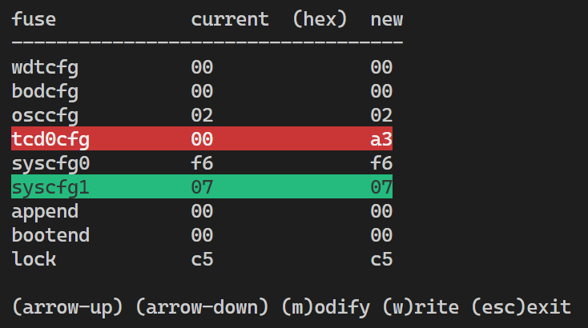

# **AVR UPDI Fuse Control**
### Python based avrDude interface to read and modify fuses of AVR UPDI controllers

<br>

<br>

<br>

Adapt script for your configuration
```
DEVICE = 't402'
COM = 'com5'
dudePath = 'c:/progs/avrdude'
```

<br>
<br>

### Links
https://github.com/avrdudes/avrdude  
https://github.com/ZakKemble/AVRDUDESS  
https://github.com/Dlloydev/jtag2updi/wiki/Arduino-Nano-HV-UPDI-Programmer  
https://github.com/Dlloydev/jtag2updi  

<br>

### Python Script Developed with vsCode
https://www.python.org/  
https://code.visualstudio.com/

<br>

---

[qrt@qland.de](mailto:qrt@qland.de) 230203
